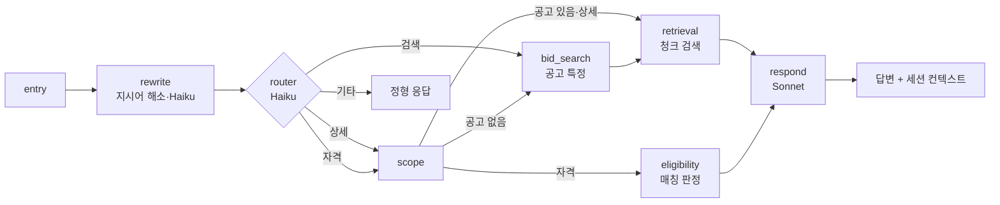

# bidmate-ai-agent

나라장터 공고에 대해 **자연어로 묻고 답하는 대화 에이전트**와, 회사 프로필 기준
**자격 매칭 엔진**, 공고 요건 **정규화 배치**를 담는 레포입니다.
`bidmate-backend`가 이 에이전트를 HTTP(`POST /turn`)로 호출하고, 요청/응답 계약
(`agents.schemas`)은 pip 의존성으로 공유합니다.

- **대화 에이전트**: LangGraph + AWS Bedrock (Haiku 라우팅 / Sonnet 응답 생성)
- **자격 매칭**: PL/pgSQL 함수 `compute_match_results()` — 10축 gate/supp 판정
- **정규화**: 공고 자격요건 원문 → `bid_require_*` 11개 테이블 (Lambda 5분 주기)

## 역할 분담

| 이름 | 담당 |
|---|---|
| **이종범** | 에이전트 그래프·라우터·응답 생성(최종 구조화 출력) · 프롬프트 · CI/CD |
| **김승재** | 하이브리드 검색 도구(OpenSearch kNN+BM25) · DB/검색 클라이언트 |
| **강태주** | 자격 매칭 SQL 엔진 · 요건 정규화기 · 마스터 테이블 설계 |
| **주대성** | 매칭 로직 백엔드 연동(match_results 서빙 경로) |

## 대화 에이전트

### 그래프 구조 (LangGraph)



- **모델 2티어**: 라우팅·질의 재작성은 Claude Haiku 4.5, 최종 응답 합성은 Claude
  Sonnet — 비용과 지연을 경로별로 분리. Bedrock을 boto3로 직접 호출(LangChain 미사용).
- **Stateless 세션**: 서버는 아무것도 저장하지 않고, `SessionContext`(최근 10턴 요약,
  직전 공고 목록, 필터)가 백엔드와의 요청/응답에 왕복.
- **구조화 출력**: LLM은 `RespondOutput{headline, items, caveat}` 슬롯만 채우고,
  최종 답변 문자열은 결정적 렌더러(`render_answer`)가 조립.

### 프롬프트 인젝션·환각 방어

공고 본문은 외부 입력이므로 응답 노드에 통제 장치를 둡니다.

- `sanitize()` — 답변에서 URL·HTML·마크다운 링크 제거
- `check_grounding()` — 답변의 모든 숫자가 검색된 근거에 존재하는지 검증,
  위반 시 1회 재생성 후 실패하면 원문 발췌 폴백
- 다음 턴용 대화 요약은 LLM 없이 결정적 템플릿으로 생성(2차 인젝션 차단)
- 매칭 점수(scoring)는 실구현 전까지 **의도적으로 미배선** — 근거 없는 수치가
  답변에 실리는 것을 막기 위해 스텁을 그래프에 연결하지 않음

## 자격 매칭 (`matching_tool/`)

단일 정본 `compute_match_results(company_id)` PL/pgSQL 함수가 **라이브 공고 전체**를
10축으로 판정합니다.

| 구분 | 축 | 미충족 시 |
|---|---|---|
| **gate** (필수 4축) | 면허 · 지역 · 기업규모 · 품목 | 하나라도 미충족 → **불가** |
| **supp** (부가 6축) | 직접생산 · 인력 · 실적 · 시공능력 · 인증 · 신용 | **보완가능** |

- 축 상태는 3단계(충족/미충족/확인필요), 최종 판정은 4단계
  (**가능 / 보완가능 / 확인필요 / 불가**). 조건 추출 실패는 미달이 아니라
  "확인필요"로 구분 — 데이터가 없다는 사실을 불가로 표시하면 참여 가능한
  공고를 놓치기 때문.
- 두 가지 소비 경로: **precompute**(`match_results` 테이블 캐시, 목록 화면·추천)와
  **on-read**(함수 직접 호출, 대화 중 단건 판정). 실측 22ms(캐시) vs 426ms(재계산).
- 추천 정렬: gate 충족 축 수 → supp 충족 축 수 → 추정가격 → bid_id(결정성).
  MAS(다수공급자계약)는 기본 제외.

## 요건 정규화 (`normalizer/`)

공고에서 LLM이 추출한 자격요건 원문(면허명·지역명·인력 등급 등 자유 텍스트)을
마스터 코드로 정규화해 `bid_require_*` 11개 테이블에 적재합니다.

- 순수 함수 정규화기(DB 미접속) + 적재 어댑터 분리. `NORMALIZER_VERSION` 상수를
  올리면 전 공고가 재정규화 대상이 되는 버전 레버.
- 증분: `merged_at > normalized_at` 또는 버전 불일치인 공고만 선별, 공고 단위
  트랜잭션으로 멱등 재적재. AWS Lambda(`realtime-normalize-dev`, 5분 주기)로 운영.
- 마스터 6종(`license_master`, `region_master`, `item_code_master`, `cert_master`,
  `personnel_grade_master`, `master_alias`)은 `master table/`의 DDL/시드로 구축.

## 디렉터리

| 디렉터리 | 역할 |
|---|---|
| `agents/` | 에이전트 런타임 — 그래프, 노드 7종, 도구 4종, FastAPI 서비스, CLI |
| `matching_tool/` | 매칭 정본 SQL + 배포 검증 쿼리 이력 |
| `normalizer/` | 정규화기 + `bid_require_*` 적재 어댑터 + Lambda 번들 |
| `master table/` | 마스터 테이블 설계 문서·DDL·시드 (RDS 적용 완료 스냅샷) |
| `deploy/` | Dockerfile, blue/green 배포 스크립트, nginx, CloudWatch 알람·메트릭 필터 |
| `monitoring/` | 로깅·메트릭 명세 (네임스페이스 `Bidmate/Agent`, 필터 11종) |
| `tests/` | pytest 약 245개 — 노드·도구·병합·정규화·핸들러 (Bedrock 실호출은 `live` 마커로 분리) |
| `scripts/` | 수동 프로브, 하이브리드 검색 튜닝 실험 |

## 배포·실행 (v1 운영 기준)

HTTP 서비스이면서 동시에 pip 의존성인 **이중 소비 구조**:

- **서비스**: 백엔드와 같은 EC2(Graviton/ARM64)에서 nginx `:8010` → blue(8011)/green(8012)
  Docker 컨테이너. GitHub Actions OIDC → ECR → SSM Run Command로 무중단 blue/green CD
  (헬스체크 → nginx 원자 전환 → 스모크 → 이전 슬롯 drain).
- **라이브러리**: 백엔드 `requirements.txt`가 커밋 SHA로 핀한 `bidmate-agents` 패키지 —
  기본 의존성은 `pydantic` 하나뿐(계약만 공유), 런타임 의존성은 `[runtime]` extra로 분리.

```bash
# 로컬 REPL
python -m agents.cli

# 서비스
uvicorn agents.service:app --port 8000    # GET /health · GET /version · POST /turn

# 테스트 (Bedrock 실호출 제외)
pytest
```

## 관련 레포

- [`bidmate-backend`](https://github.com/final-pjt-supply/bidmate-backend) — 이 에이전트를 호출하는 API 서버
- [`bidmate-pipeline`](https://github.com/final-pjt-supply/bidmate-pipeline) — `bid_table`·OpenSearch 인덱스를 채우는 데이터 파이프라인
- [`bidmate-frontend`](https://github.com/final-pjt-supply/bidmate-frontend) — 화면 (비드봇 챗 UI)
